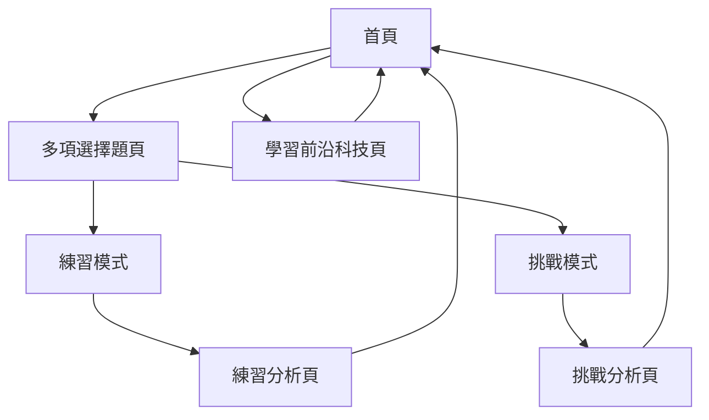

# HKDSE 生物科溫習程式 — 內容規格文件

> 本文件為後續開發的「唯一依據」（source of truth）。所有題庫內容、課題清單、前沿科技資料與應用程式架構，均以本文件為準。
> 文件語言：繁體中文（香港用語）。編碼：UTF-8。

---

## 1. 工作區現有檔案分析

工作區 `c:/Users/user/Desktop` 內現有檔案如下：

| 檔案／資料夾 | 說明 |
| --- | --- |
| [`Bio prog.html`](Bio prog.html:1) | 已存在的 HTML 網頁應用程式雛形（1903 行），單一檔案，內嵌 CSS 與 JavaScript |
| `Biooooooooooooooooooo/` | 資料夾，內含 37 個雅集（Aristo）HKDSE 生物科課本電子版 PDF：`te_01_c.pdf` 至 `te_37_c.pdf`，每個 PDF 對應一個課題（章節） |

### 1.1 `Bio prog.html` 內容摘要

- 程式名稱：「生物溫習程式」，`lang="zh-Hant"`、`charset="UTF-8"`。
- 採用單頁式（SPA）結構，以 CSS 類別 `.hidden` 切換各區塊（首頁、練習模式、練習分析、挑戰模式、挑戰分析等）。
- 內含 `topicNames` 物件，**目前僅定義課題 1–10 的名稱**，課題 11–37 為佔位（顯示「課題 11」…「課題 37」），並有註解「11–37 可按需要自行命名」。
- 內含 `questionBank` 物件，**目前僅有課題 1–3 的示範題目（每課題 10 題）**，其餘課題尚未填入。
- 已有練習模式（逐題作答、即時回饋、命中率分析）與挑戰模式（計時、計分、逐題回顧）的雛形邏輯。
- 題目資料結構為 `{ question, options: [{ text, correct, reason }], ... }`，與本規格的題庫結構方向一致，但需統一字段命名。
- **尚未有**「學習前沿科技」頁面與資料。

### 1.2 課本 PDF（`te_01_c.pdf` 至 `te_37_c.pdf`）

- 37 個 PDF 對應 37 個章節（課題），每個 PDF 首頁載有章節標題。
- 這些章節標題即為本規格採用之 **37 課題清單**。

---

## 2. 37 課題清單（來源：課本 PDF 章節標題）

> **來源說明**：以下 37 個課題全部取自工作區 `Biooooooooooooooooooo/` 資料夾內的課本 PDF 章節標題（`te_01_c.pdf` 至 `te_37_c.pdf`），並非依課程指引補足。
> 注意：現有 `Bio prog.html` 內的 `topicNames` 只定義了課題 1–10，且其名稱（如「生物學與科學方法」「細胞作為生命的基本單位」）與課本章節標題（「生物學入門」「細胞組織」）不完全一致。開發時**以本規格下表為準**，並更新 `Bio prog.html` 的 `topicNames`。

| 編號 | 課題名稱（繁體中文） | 部分 | 對應 PDF |
| --- | --- | --- | --- |
| 01 | 生物學入門 | 必修 | `te_01_c.pdf` |
| 02 | 生命分子 | 必修 | `te_02_c.pdf` |
| 03 | 細胞組織 | 必修 | `te_03_c.pdf` |
| 04 | 物質穿越細胞膜的活動 | 必修 | `te_04_c.pdf` |
| 05 | 新陳代謝與酶 | 必修 | `te_05_c.pdf` |
| 06 | 食物與人類 | 必修 | `te_06_c.pdf` |
| 07 | 人的營養 | 必修 | `te_07_c.pdf` |
| 08 | 人體的氣體交換 | 必修 | `te_08_c.pdf` |
| 09 | 人體內物質的轉運 | 必修 | `te_09_c.pdf` |
| 10 | 植物的營養與氣體交換 | 必修 | `te_10_c.pdf` |
| 11 | 植物的蒸騰、轉運與支持 | 必修 | `te_11_c.pdf` |
| 12 | 細胞週期與細胞分裂 | 必修 | `te_12_c.pdf` |
| 13 | 有花植物的生殖 | 必修 | `te_13_c.pdf` |
| 14 | 人的生殖 | 必修 | `te_14_c.pdf` |
| 15 | 生長與發育 | 必修 | `te_15_c.pdf` |
| 16 | 刺激、感受器與反應 | 必修 | `te_16_c.pdf` |
| 17 | 人體的協調 | 必修 | `te_17_c.pdf` |
| 18 | 人體的運動 | 必修 | `te_18_c.pdf` |
| 19 | 體內平衡 | 必修 | `te_19_c.pdf` |
| 20 | 生態系 | 必修 | `te_20_c.pdf` |
| 21 | 光合作用 | 必修 | `te_21_c.pdf` |
| 22 | 呼吸作用 | 必修 | `te_22_c.pdf` |
| 23 | 個人健康與傳染病 | 必修 | `te_23_c.pdf` |
| 24 | 非傳染病與疾病的預防 | 必修 | `te_24_c.pdf` |
| 25 | 身體的防禦機制 | 必修 | `te_25_c.pdf` |
| 26 | 基礎遺傳學 | 必修 | `te_26_c.pdf` |
| 27 | 分子遺傳學 | 必修 | `te_27_c.pdf` |
| 28 | 生物工程 | 必修 | `te_28_c.pdf` |
| 29 | 生物多樣性 | 必修 | `te_29_c.pdf` |
| 30 | 生命的起源與進化的證據 | 必修 | `te_30_c.pdf` |
| 31 | 進化的機制與物種形成 | 必修 | `te_31_c.pdf` |
| 32 | 體温調節 | 選修（人體生理學：調節與控制） | `te_32_c.pdf` |
| 33 | 水份調節 | 選修（人體生理學：調節與控制） | `te_33_c.pdf` |
| 34 | 血液內氣體成分的調節 | 選修（人體生理學：調節與控制） | `te_34_c.pdf` |
| 35 | 生殖週期的激素控制 | 選修（人體生理學：調節與控制） | `te_35_c.pdf` |
| 36 | 人類對環境的影響 | 選修（應用生態學） | `te_36_c.pdf` |
| 37 | 污染控制與保育 | 選修（應用生態學） | `te_37_c.pdf` |

- **必修部分**：第 01–31 章（31 個課題）。
- **選修部分**：第 32–37 章（6 個課題）。
  - 第 32–35 章屬選修單元「人體生理學：調節與控制」。
  - 第 36–37 章屬選修單元「應用生態學」。
- 題庫總量：37 課題 × 每課題 20 題 = **740 題**。

---

## 3. 五種前沿科技資料

以下 5 種科技均與 HKDSE 生物科課程直接相關，工作區檔案未提供專門的前沿科技清單，故依 DSE 課程關聯性選定，並在下方列出完整內容。

### 3.1 基因工程與基因編輯（CRISPR-Cas9）

- **標題**：基因工程與基因編輯（CRISPR-Cas9）
- **副標題**：精準改寫生命藍圖的分子剪刀
- **相關課題**：第 26 章 基礎遺傳學、第 27 章 分子遺傳學、第 28 章 生物工程
- **核心概念**：
  - 基因是染色體上的一段 DNA，其鹼基序列決定多肽（蛋白質）的氨基酸序列，進而決定生物特徵。
  - 重組 DNA 技術利用限制酶（分子剪刀）與 DNA 連接酶（分子膠水）把目標基因插入質粒載體，再轉移入宿主細胞。
  - CRISPR-Cas9 系統由引導 RNA 辨認目標 DNA 序列，再由 Cas9 核酸酶在特定位置切斷 DNA，實現精準基因編輯。
  - 應用包括基因治療、改良農作物、研究基因功能與建立疾病模型。
  - 涉及倫理議題，例如人類胚胎基因編輯的安全性與公平性。
- **科技概念說明**：CRISPR-Cas9 是近年發展的基因編輯工具，利用引導 RNA 引領 Cas9 蛋白在基因組特定位置造成雙鏈斷裂，細胞修復時可刪除、取代或插入 DNA 序列。相比早期基因工程，它更精準、快速且成本較低，把重組 DNA 技術推進至「直接在生物基因組內編輯」的新階段。
- **可靠來源**：美國國立人類基因組研究所（NHGRI，屬 NIH） — https://www.genome.gov/genetics-glossary/CRISPR

### 3.2 幹細胞技術

- **標題**：幹細胞技術
- **副標題**：未分化細胞的再生與治療潛力
- **相關課題**：第 03 章 細胞組織、第 15 章 生長與發育、第 24 章 非傳染病與疾病的預防
- **核心概念**：
  - 幹細胞是未分化的細胞，能自我更新，並在特定條件下分化成多種特化細胞。
  - 胚胎幹細胞具較廣的分化潛力，成體幹細胞的分化潛力則較有限。
  - 細胞分化是指細胞特化成不同種類，以發揮不同功能（第 15 章）。
  - 應用包括再生醫學（修補受損組織）、藥物測試與疾病研究。
  - 涉及胚胎幹細胞來源的道德倫理爭議。
- **科技概念說明**：幹細胞技術利用幹細胞的自我更新與分化能力，在體外培養並引導其分化成目標細胞（如神經細胞、心肌細胞），再移植回病人體內以修補受損組織。誘導性多能幹細胞（iPSC）技術更可把成體細胞「重編程」為具胚胎幹細胞潛力的細胞，避免使用胚胎。
- **可靠來源**：美國國立衞生研究院（NIH）幹細胞資訊 — https://stemcells.nih.gov/

### 3.3 疫苗技術（mRNA 疫苗）

- **標題**：疫苗技術（mRNA 疫苗）
- **副標題**：以遺傳指令誘發免疫記憶的新一代疫苗
- **相關課題**：第 23 章 個人健康與傳染病、第 25 章 身體的防禦機制、第 27 章 分子遺傳學
- **核心概念**：
  - 疫苗接種把抗原引入身體，誘發初次免疫反應並產生記憶細胞，使再次接觸病原體時能迅速產生再次反應（第 25 章）。
  - 主動免疫由自身免疫系統產生，效果持久；mRNA 疫苗屬人工主動免疫。
  - 轉錄與轉譯：mRNA 攜帶遺傳密碼，在細胞質核糖體合成蛋白質（第 27 章）。
  - mRNA 疫苗利用脂質納米粒子把編碼病原體抗原的 mRNA 送入細胞，由細胞自行合成抗原蛋白，誘發免疫反應。
  - 優點包括設計快、生產迅速、不整合入基因組。
- **科技概念說明**：mRNA 疫苗不含完整病原體，而是把編碼病原體表面抗原（如刺突蛋白）的信使 RNA 送入人體細胞，由核糖體轉譯出抗原蛋白，免疫系統識別後產生抗體與記憶細胞。由於只需更改 mRNA 序列即可應對新病毒株，研發與生產遠較傳統疫苗快速。
- **可靠來源**：美國疾病控制與預防中心（CDC） — https://www.cdc.gov/vaccines/covid-19/hcp/mrna-vaccine.html

### 3.4 單株抗體與免疫治療

- **標題**：單株抗體與免疫治療
- **副標題**：專一性抗體對抗疾病與癌症
- **相關課題**：第 23 章 個人健康與傳染病、第 25 章 身體的防禦機制、第 28 章 生物工程
- **核心概念**：
  - B 細胞被抗原活化後分化成漿細胞，分泌具高度專一性的抗體（第 25 章）。
  - 抗體能凝集病原體、促進吞噬、中和毒素，或經溶菌作用破壞病原體。
  - 單株抗體由單一 B 細胞（或雜交瘤細胞）繁衍而成，只針對單一抗原決定位，專一性高。
  - 應用包括癌症標靶治療、免疫治療（如免疫檢查點抑制劑、CAR-T 細胞治療）、診斷試劑與自身免疫疾病治療。
  - 免疫治療利用自身免疫系統對抗疾病（第 25 章 T 細胞治療）。
- **科技概念說明**：單株抗體技術透過融合骨髓瘤細胞與能產生特定抗體的 B 細胞，形成可無限增殖且持續分泌單一抗體的雜交瘤，大量生產針對特定抗原的抗體。在癌症治療中，單株抗體可標記癌細胞讓免疫系統攻擊，或阻斷癌細胞生長訊息，達致「標靶」效果。
- **可靠來源**：美國國家癌症研究所（NCI） — https://www.cancer.gov/about-cancer/treatment/types/immunotherapy/monoclonal-antibodies

### 3.5 生物資訊學與 DNA 指紋分析

- **標題**：生物資訊學與 DNA 指紋分析
- **副標題**：從鹼基序列解讀生命與鑑定個體
- **相關課題**：第 26 章 基礎遺傳學、第 27 章 分子遺傳學、第 28 章 生物工程、第 30 章 生命的起源與進化的證據
- **核心概念**：
  - DNA 指紋分析利用 DNA 高變異區域（非編碼重複序列）在個體間的長度差異來鑑定身份（第 28 章）。
  - 凝膠電泳按分子大小分離 DNA 片段；較小片段移動較快（第 28 章）。
  - 生物資訊學結合電腦科學與生物學，儲存、分析與比較大量 DNA 鹼基序列數據（如人類基因組計畫）。
  - 比較 DNA 鹼基序列或蛋白質氨基酸序列可推斷生物的進化關係（第 30 章）。
  - 應用包括法證科學、親子鑑證、遺傳病診斷、物種鑑定與進化研究。
- **科技概念說明**：DNA 指紋分析把個體 DNA 經限制酶切割後以凝膠電泳分離，形成獨特的條帶式樣以鑑定身份；生物資訊學則以演算法與資料庫處理海量序列數據，把個體基因組與參考基因組比對。兩者結合成為現代法證、親子鑑定與精準醫學的基礎工具。
- **可靠來源**：美國國立人類基因組研究所（NHGRI） — https://www.genome.gov/genetics-glossary/DNA-Fingerprinting

---

## 4. 應用程式架構規劃

### 4.1 建議檔案結構

```
（工作區根目錄）
├── content-spec.md      ← 本規格文件（唯一依據）
├── index.html           ← 主頁面容器，含所有頁面區塊（SPA）
├── styles.css           ← 全站樣式
├── app.js               ← 應用程式邏輯：頁面切換、模式流程、計分、計時、localStorage 記錄
├── topics.js            ← 37 課題清單資料（TOPICS 陣列）
├── questionBank1.js     ← 課題 01–13 題庫（13 × 20 = 260 題）
├── questionBank2.js     ← 課題 14–25 題庫（12 × 20 = 240 題）
├── questionBank3.js     ← 課題 26–37 題庫（12 × 20 = 240 題）
└── frontierTech.js      ← 5 種前沿科技資料（FRONTIER_TECHS 陣列）
```

- 題庫共 740 題，平均分入三個 `questionBank*.js`，避免單一檔案過大。
- 每個 `questionBank*.js` 以全域常數（例如 `const QUESTION_BANK_1 = {...}`）匯出，並在 `index.html` 中於 `app.js` 之前載入。
- 三個題庫檔案再合併為單一題庫物件（例如 `const QUESTION_BANK = Object.assign({}, QUESTION_BANK_1, QUESTION_BANK_2, QUESTION_BANK_3)`）。

### 4.2 頁面與功能流程

共有 7 個主要頁面／視圖：

1. **首頁**：顯示程式名稱、簡介、三個主功能入口（練習模式、挑戰模式、學習前沿科技），以及題庫總覽（37 課題、740 題）。
2. **多項選擇題頁（課題選擇）**：以表格列出 37 個課題（編號、名稱、必修／選修標記、題數），供練習模式與挑戰模式共用；點擊課題進入對應模式。
3. **練習模式**：選定課題後逐題作答（一次一題）；作答後即時顯示對錯、正確答案，以及**三個錯誤選項各自的錯誤原因**；完成 20 題後前往練習分析。
4. **練習分析頁**：顯示命中率（答對／總題數、百分比）、答錯題目清單（含正確答案與錯誤原因）、按課題累計的歷史表現（存於 localStorage）。
5. **挑戰模式**：可選範圍（單一課題或全部 37 課題隨機抽題）、限定題數、計時作答、答對計分；提交後前往挑戰分析。
6. **挑戰分析頁**：顯示得分、用時、正確率、逐題回顧（題目、你的答案、正確答案、對應課題編號）、最佳紀錄。
7. **學習前沿科技頁**：以卡片網格展示 5 種前沿科技；每張卡片顯示標題、副標題、相關課題標籤、核心概念點列、科技概念說明，以及可靠來源連結（新視窗開啟）。

流程圖（Mermaid）：



### 4.3 課題資料結構（topics.js）

```js
// topics.js
const TOPICS = [
  { id: 1,  name: "生物學入門", part: "必修", pdf: "te_01_c.pdf" },
  { id: 2,  name: "生命分子", part: "必修", pdf: "te_02_c.pdf" },
  // ... 共 37 項
  { id: 32, name: "體温調節", part: "選修", elective: "人體生理學：調節與控制", pdf: "te_32_c.pdf" },
  // ...
  { id: 37, name: "污染控制與保育", part: "選修", elective: "應用生態學", pdf: "te_37_c.pdf" }
];
```

欄位說明：

| 欄位 | 類型 | 說明 |
| --- | --- | --- |
| `id` | number | 課題編號（1–37） |
| `name` | string | 課題名稱（繁體中文） |
| `part` | string | `"必修"` 或 `"選修"` |
| `elective` | string（選填） | 選修課題的選修單元名稱 |
| `pdf` | string（選填） | 對應課本 PDF 檔名 |

### 4.4 題庫資料結構（questionBank*.js）

每課題為一個鍵值，值為含 20 個題目物件的陣列。每條題目包含：題目文字、4 個選項、正確答案索引、3 個錯誤選項各自的錯誤原因。

```js
// questionBank1.js（範例：課題 1）
const QUESTION_BANK_1 = {
  1: [
    {
      question: "以下哪項最能說明「生物學」這一學科的範圍？",
      options: [
        { text: "只研究動物的行為", correct: false, reason: "生物學同時研究動物、植物及微生物，不只限於動物行為。" },
        { text: "以科學方法研究生物及生命現象", correct: true },
        { text: "只研究人體的結構", correct: false, reason: "生物學涵蓋所有生物，不限於人體結構。" },
        { text: "只研究基因與遺傳", correct: false, reason: "基因與遺傳只是生物學的其中一個範疇。" }
      ],
      correctIndex: 1,
      explanation: "生物學是以科學方法研究生物及生命現象的學科。" // 選填
    }
    // 共 20 題
  ]
  // 課題 2–13 各 20 題
};
```

欄位說明：

| 欄位 | 類型 | 必填 | 說明 |
| --- | --- | --- | --- |
| `question` | string | 是 | 題目文字（繁體中文） |
| `options` | array | 是 | 4 個選項，長度固定為 4 |
| `options[].text` | string | 是 | 選項文字 |
| `options[].correct` | boolean | 是 | 是否正確答案（4 個選項中恰有 1 個為 `true`） |
| `options[].reason` | string | 是（錯誤選項） | 該錯誤選項的錯誤原因；正確選項可省略 |
| `correctIndex` | number | 是 | 正確答案索引（0–3，指向 `options` 陣列） |
| `explanation` | string | 否 | 正確答案的簡短解說 |

**資料品質要求**：

- 每課題恰好 20 題、每題恰好 4 個選項、恰好 1 個正確答案。
- 3 個錯誤選項**必須**各自附上 `reason`（錯誤原因），以供練習模式即時回饋使用。
- 題目內容須對應「第 2 節 37 課題清單」的課題範圍。

### 4.5 前沿科技資料結構（frontierTech.js）

```js
// frontierTech.js
const FRONTIER_TECHS = [
  {
    id: 1,
    title: "基因工程與基因編輯（CRISPR-Cas9）",
    subtitle: "精準改寫生命藍圖的分子剪刀",
    relatedTopicIds: [26, 27, 28],
    coreConcepts: [
      "基因是染色體上的一段 DNA，其鹼基序列決定多肽的氨基酸序列。",
      "重組 DNA 技術利用限制酶與 DNA 連接酶把目標基因插入質粒載體。",
      "CRISPR-Cas9 由引導 RNA 辨認序列、Cas9 核酸酶切斷 DNA。"
    ],
    description: "CRISPR-Cas9 是近年發展的基因編輯工具，利用引導 RNA 引領 Cas9 蛋白在基因組特定位置造成雙鏈斷裂，細胞修復時可刪除、取代或插入 DNA 序列。",
    source: {
      name: "美國國立人類基因組研究所 NHGRI",
      url: "https://www.genome.gov/genetics-glossary/CRISPR"
    }
  }
  // 共 5 項
];
```

欄位說明：

| 欄位 | 類型 | 說明 |
| --- | --- | --- |
| `id` | number | 科技編號（1–5） |
| `title` | string | 標題（繁體中文） |
| `subtitle` | string | 副標題（繁體中文） |
| `relatedTopicIds` | number[] | 相關課題編號（2–4 個，對應 TOPICS 的 `id`） |
| `coreConcepts` | string[] | 核心概念點列（3–5 點） |
| `description` | string | 科技概念說明（2–3 句） |
| `source.name` | string | 來源機構名稱 |
| `source.url` | string | 可靠網站完整 URL |

---

## 5. 後續開發注意事項

1. **檔案編碼**：所有 HTML／JS／CSS 與本規格文件一律使用 **UTF-8** 編碼；`index.html` 需保留 `<meta charset="UTF-8">`。
2. **字體**：介面建議使用 `"Microsoft JhengHei"` 或 `"Noto Sans TC"`，確保繁體中文正常顯示。
3. **特殊字符與用字統一**：
   - 課題 32 統一為「體温調節」（課本 PDF 標題用「温」）；課題 33 統一為「水份調節」。
   - 題目與選項中的引號建議使用全形「」或「"」，避免與 JavaScript 字串分隔符衝突；如題目內需用引號，建議改用「」。
   - DNA／mRNA／CRISPR 等專有名詞保持原文大寫樣式。
4. **與現有 `Bio prog.html` 的銜接**：現有檔案的 `topicNames`（課題 1–10）與本規格課題名稱不一致，且課題 11–37 未定義；開發時應以本規格「第 2 節」的 37 課題清單覆寫 `topicNames`，並將示範題目遷移至 `questionBank*.js`。
5. **題庫檔案拆分**：740 題分為三個檔案（260／240／240 題），載入順序為 `topics.js` → `questionBank1.js` → `questionBank2.js` → `questionBank3.js` → `frontierTech.js` → `app.js`。
6. **數據驗證**：建議在 `app.js` 載入時執行一次驗證，確認 37 課題各 20 題、每題 4 選項、恰有 1 個正確答案、3 個錯誤選項均含 `reason`，避免後期內容錯誤。
7. **來源連結**：前沿科技來源連結一律以新視窗（`target="_blank"` + `rel="noopener"`）開啟。
8. **範圍限制**：本規格只涵蓋內容與架構規劃；題目撰寫（740 題）與程式實作屬後續開發階段工作。
